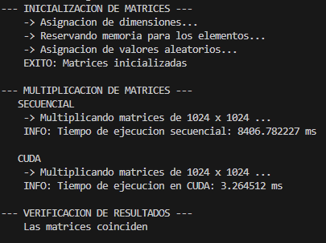

# Corto #15
## Programación Paralela en CUDA
**Universidad del Valle de Guatemala**\
**Facultad de Ingeniería**\
**Departamento de Ciencias de la Computación**\
**Computación Paralela**

---
### Autor:
Diego Leiva

---
## Requsitos
- Dispositivo con capacidad para usar CUDA
- CUDA TOOLKIT 12.6 en su maquina
- Visual Studio 2022 (Para compilador de C/C++)
  
## Instrucciones

### Compilación de Codigo
Para compilar el codigo CUDA ejecute el siguiente comando:
```bash
nvcc matrix_multiplication.cu -o mat_mul
```

### Ejecucion del Programa
Para ejecutar el programa ejecute el siguiente comando:
```bash
./mat_mul.exe
```

### Output esperado


### Opcional
Puede entrar al codigo fuente en **matrix_multiplication.cu** y reemplazar el valor de `N`:
```C
int main() {
    int N = 1024;   //Sustituir por la dimension deseada
    ...
```
en la funcion Main